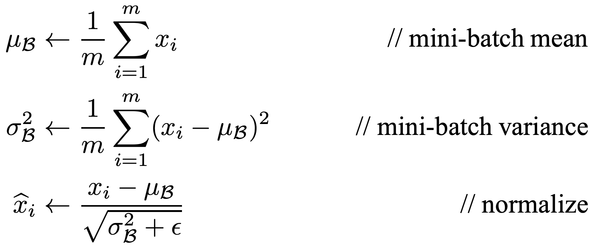
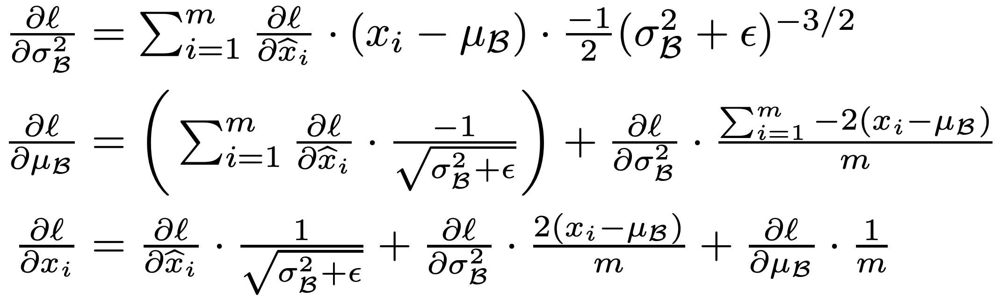

# CSE 490g1 / 599g1 Homework 2 #

Welcome friends,

For the third assignment we'll be implementing a powerful tool for improving optimization, batch normalization!

You'll have to copy over your answers from the previous assignment.

## 7. Batch Normalization ##

The idea behind [batch normalization](https://arxiv.org/pdf/1502.03167.pdf) is simple: at every layer, before the bias and activation function, we'll normalize the layer output so every neuron has zero mean and unit variance. However, this simple technique provides huge benefits for model stability, convergence, and regularization.

### Batch Norm and Convolutions ###

Batch normalization with fully connected layers is easy. You simply calculate the batch statistics for each neuron and then normalize. With our framework, every row is a different example in a batch and every column is a different neuron so we will calculate statistics for each column and then normalize so that every column has mean 0 and variance 1.

With convolutional layers we are going to normalize the output of a filter over a batch of images. Each filter produces a single channel in the output of a convolutional layer. Thus for batch norm, we are normalizing across a batch of channels in the output. So, for example, we calculate the mean and variance for all the 1st channels across all the examples, all the 2nd channels across all the examples, etc. Another way of thinking about it is we are normalizing the output of a single filter, which gets applied both to all of the examples in a batch but also at numerous spatial locations for every image.

Thus for our batch normalization functions we will be normalizing across rows but also across columns depending on the spatial component of a feature map. Check out `batch_norm.c`, I've already filled in the `mean` example for calculating the mean of a batch.

The `spatial` parameter will tell you how many elements are in a spatial group (i.e. channel) of your output. So, if your convolutional layer outputs a `32 x 32 x 8` image and has a batch size of 128, the matrix `x` will have 128 rows and 8192 columns. We want to calculate a mean for every channel thus our matrix `m` will have 1 row and 8 columns (since there are 8 channels in the output). The images we are processing are `32 x 32` so the `spatial` parameter in this case will be the integer 1024. In a fully connected layer, the `spatial` parameter would always be 1 and we would calculate separate means for each neuron in the output.

### Forward propagation ###

These are the forward propagation equations from the [original paper](https://arxiv.org/abs/1502.03167). Note, we'll just use `x̂` as the output, we'll skip the scaling factor for now and our layers already have a bias component that they will use on their own.

### 7.1 `variance` ###

Fill in the section to compute the variance of a feature map. As in the `mean` computation, we will compute variance for each filter. We need the previously computed `mean` for this computation so it is passed in as a parameter. Remember, variance is just the average squared difference of an element from the mean:

Don't take the square root just yet, that would be standard deviation!

### 7.2 `normalize` ###

To normalize our output, we simply subtract the mean from every element and divide by the standard deviation (now you'll need a square root). When you're dividing by the standard deviation it can be wise to add in a small term (the epsilon in the batchnorm equations) to prevent dividing by zero. Especially if you are using RELUs, you may occassionally have a batch with 0 variance.

### Understanding the forward pass ###

`batch_normalize_forward` shows how we process the forward pass of batch normalization. Mostly we're doing what you'd expect, calculating mean and variance and normalizing with them:

    matrix m = mean(x, spatial);
    matrix v = variance(x, m, spatial);
    
    matrix x_norm = normalize(x, m, v, spatial);

We are also keeping track of a rolling average of our mean and variance. During training or when processing large batches we can calculate means and variances but if we just want to process a single image it can be hard to get good statistics, we have to batch to norm against! Thus if we have a batch size of 1 we normalize using our rolling averages:

    if (x.rows == 1){
        return normalize(x, l.rolling_mean, l.rolling_variance, spatial);
    }

We assume the `l.rolling_mean` and `l.rolling_variance` matrices are initialized when the layer is created. Note that we use them to calculate the `spatial` size of the output.

We also have the matrix pointer `l.x` which will keep track of the input to the batch norm process. We will need to remember this for the backward step!

IMPORTANT: We need to initialize our rolling matrices and `l.x` when we create a convolutional or connected layer. In `make_connected_layer`, add the following lines before the return statement:

    l.x = calloc(1, sizeof(matrix));
    l.rolling_mean = make_matrix(1, outputs);
    l.rolling_variance = make_matrix(1, outputs);

Add similar lines in `make_convolutional_layer`, using the appropriate size for the rolling average matrices.

While we're at it, let's add in the code to run batch normalization if it's enabled for a particular layer. We want to run batchnorm after the inputs have been multiplied by the weights of a layer but before the bias is added and before the activation function is computed. Each layer has the flag `l.batchnorm` that signals whether batch norm should be run for that layer. Add the following code in the appropriate spot in both the connected and convolutional layer code:

    if(l.batchnorm){
        matrix xnorm = batch_normalize_forward(l, out);
        out = xnorm;
    }

### Backward propagation ###

The backward propagation step looks like this:

So to backward propagate we'll need to calculate these intermediate results, ∂l/∂µ and ∂l/∂σ². Then, using them, we can calculate ∂l/∂x̂. Note that the second summation in ∂l/∂µ evaluates to zero. Thus you can leave out the second term and just use the summation involving ∂l/∂x̂.

### 7.3 `delta_mean` ###

Calculate ∂l/∂µ.

### 7.4 `delta_variance` ###

Calculate ∂l/∂σ².

### 7.5 `delta_batch_norm` ###

Using the intermediate results, calculate ∂l/∂x̂.

### Add backward processing to your layers ###

Add this code to the backward processing of the connected and convolutional layers:

    if(l.batchnorm){
        matrix dx = batch_normalize_backward(l, delta);
        free_matrix(delta);
        l.delta[0] = delta = dx;
    }

Think about where you added the forward code. Where should the backward processing step happen?

### 7.6 Using your batchnorm ###

Try out batchnorm! To add it to a layer, just make this simple change:

    make_convolutional_layer(16, 16, 8, 16, 3, 1, LRELU), # No batch norm
    make_convolutional_layer(16, 16, 8, 16, 3, 1, LRELU, 1), # Batch norm!
    make_convolutional_layer(16, 16, 8, 16, 3, 1, LRELU, batchnorm=1), # Also batch norm!

You should be able to add it to convolutional or connected layers. The standard for batch norm is to use it at every layer except the output. First, train the `conv_net` as usual. Then try it with batchnorm. Does it do better??

In class we learned about annealing your learning rate to get better convergence. We ALSO learned that with batch normalization you can use larger learning rates because it's more stable. Increase the starting learning rate to `.1` and train for multiple rounds with successively smaller learning rates. Using just this model, what's the best performance you can get?

## PyTorch Section ##

Upload `homework2_colab.ipynb` to Colab and train a neural language model.

## Turn it in ##

First run the `collate.sh` script by running:

    bash collate.sh
    
This will create the file `submit.tar.gz` in your directory with all the code you need to submit. The command will check to see that your files have changed relative to the version stored in the `git` repository. If it hasn't changed, figure out why, maybe you need to download your ipynb from google?

Submit `submit.tar.gz` in the file upload field for Homework 2 on Canvas.

